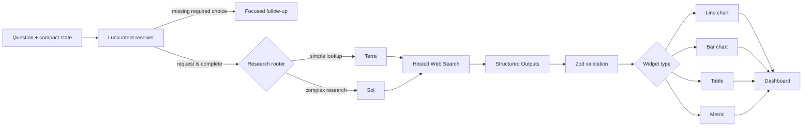

# Polaris

<p align="center">
  <strong>A live, source-backed data dashboard built from natural-language questions.</strong>
</p>

<p align="center">
  <a href="https://polaris-weifanwu.deep-robin-3429.chatgpt.site"></a>
  <a href="./LICENSE"></a>
  
  
</p>

<p align="center">
  <a href="https://polaris-weifanwu.deep-robin-3429.chatgpt.site">Live application</a>
  ·
  <a href="https://github.com/weifanwu/polaris/issues">Report an issue</a>
  ·
  <a href="#quick-start">Run locally</a>
</p>

<p align="center">
  
</p>

Polaris turns a data question into a reusable dashboard widget. It resolves follow-up answers, searches current public sources, validates the resulting dataset, and renders it as a chart, table, or metric card. Every generated widget keeps its source links and can be refreshed independently.

The repository is publicly available for personal, educational, research, and other noncommercial use under the [PolyForm Noncommercial License 1.0.0](./LICENSE).

## Table of contents

- [Why Polaris](#why-polaris)
- [Features](#features)
- [How it works](#how-it-works)
- [Cost-aware model routing](#cost-aware-model-routing)
- [Data integrity](#data-integrity)
- [Technology](#technology)
- [Quick start](#quick-start)
- [Configuration](#configuration)
- [Commands](#commands)
- [API](#api)
- [Project structure](#project-structure)
- [Security and privacy](#security-and-privacy)
- [Deployment](#deployment)
- [Contributing](#contributing)
- [License](#license)

## Why Polaris

Most AI data answers disappear into chat history. Polaris turns each successful answer into a persistent, interactive object on a personal dashboard.

Ask questions such as:

- “Show Microsoft’s closing price for the last seven completed trading days.”
- “Compare the monthly CPI inflation rate in Canada and the United States for the last 12 complete months.”
- “Compare the monthly change in MLS® HPI benchmark prices across GTA and Ottawa, leaving unverifiable months blank.”
- “Show the Bank of Canada policy-rate changes over the last year.”

Polaris preserves the request, retrieved values, source links, visualization choice, and refresh state in one portable `WidgetSpec`.

## Features

### Live research agent

- Uses the OpenAI Responses API with hosted Web Search.
- Prefers official, primary, and directly attributable sources.
- Searches with canonical English names, tickers, and identifiers where useful.
- Splits fragmented research by source, entity, or date range.
- Supports derived calculations such as month-over-month change when the underlying values are verifiable.
- Stops within an explicit search budget instead of retrying indefinitely.

### Multi-turn clarification and memory

- Asks one focused follow-up only when a missing choice materially changes the dataset.
- Remembers confirmed metrics, regions, periods, comparison groups, calculation methods, and chart preferences.
- Replaces the active context when the user starts a new, unrelated request.
- Compresses confirmed requirements into a bounded 500-character conversation state.
- Keeps up to 20 chat messages locally for presentation without resending the full transcript on every request.

### Structured data and visualizations

- Supports `line_chart`, `bar_chart`, `table`, and `metric` widgets.
- Constrains model output with Structured Outputs and a fixed JSON Schema.
- Validates columns, rows, types, sources, and chart requirements with Zod.
- Supports up to six columns, 30 rows, and five clickable sources per widget.
- Renders unavailable numeric values as chart gaps rather than silently converting them to zero.

### Flexible dashboard

- Drag widgets anywhere on the responsive grid.
- Resize from all four edges and four corners.
- Open any widget in a full-screen focus view; press `Esc` to exit.
- Refresh or remove widgets independently.
- Preserve existing data when a refresh fails.
- Enforce a five-minute refresh cooldown to prevent accidental duplicate spend.
- Persist widgets, layouts, chat history, and compact conversation state in browser `localStorage`.

### Usage visibility

Every agent response reports:

- input tokens;
- cached input tokens;
- model calls; and
- Web Search calls.

This makes prompt growth, cache behavior, and expensive research paths visible during normal use.

## How it works



The request lifecycle is deliberately bounded:

1. The client sends the current question and a compact conversation state.
2. A lightweight intent model resolves follow-up answers into one standalone query.
3. Simple lookups use the fast research model; multi-source and long time-series requests use the advanced model.
4. The selected model searches within a fixed tool-call budget and returns a structured result.
5. The server attaches retrieved source URLs and validates the complete widget contract.
6. The browser renders and stores the widget locally.

## Cost-aware model routing

Polaris assigns each stage to the least expensive model tier that fits its job:

| Stage | Default model | Reasoning | Search budget |
| --- | --- | --- | --- |
| Clarification and context compression | `gpt-5.6-luna` | None | No search |
| Direct and short data lookups | `gpt-5.6-terra` | Low | Up to 3 calls |
| Multi-source comparisons and long series | `gpt-5.6` | Low | Up to 6 calls |

Additional safeguards include:

- a stable prompt prefix and `prompt_cache_key` per route;
- no automatic full-query retry after an unsuccessful research pass;
- a 500-character conversation-state limit;
- at most four short fallback messages during migration from older local state;
- lower Web Search context for direct lookups; and
- a refresh cooldown for recently generated widgets.

Model names and budgets are configurable without changing application code.

## Data integrity

Polaris follows a strict evidence contract:

- Retrieved values are never replaced with remembered, estimated, or interpolated numbers.
- Arithmetic may be calculated only from retrieved source values.
- A month-over-month calculation requires both adjacent verified months.
- Partial datasets are allowed by default and must disclose their actual coverage.
- Comparison charts may contain gaps when one series is unavailable for a given date.
- A widget is rejected when it has no trustworthy source or cannot be rendered honestly.

Web Search is inherently nondeterministic, and third-party pages can change or become unavailable. Verify financial, medical, legal, and other high-stakes information against the linked original source.

## Technology

| Layer | Technology |
| --- | --- |
| Interface | React 19, TypeScript, Tailwind CSS |
| Application runtime | Vinext, Vite, React Server Components |
| AI | OpenAI Node SDK, Responses API, Web Search, Structured Outputs |
| Validation | Zod 4 |
| Charts | Recharts 3 |
| Dashboard layout | React Grid Layout 2 |
| Icons | Lucide React |
| Persistence | Browser `localStorage` |
| Hosting | OpenAI Sites with a Cloudflare Workers-compatible build |

## Quick start

### Requirements

- Node.js 22.13.0 or newer
- npm
- An OpenAI API key

### Installation

```bash
git clone https://github.com/weifanwu/polaris.git
cd polaris
npm ci
cp .env.example .env.local
```

Add your API key to `.env.local`:

```dotenv
OPENAI_API_KEY=your_openai_api_key
OPENAI_MODEL=gpt-5.6
OPENAI_FAST_MODEL=gpt-5.6-terra
OPENAI_INTENT_MODEL=gpt-5.6-luna
```

Start the development server:

```bash
npm run dev
```

Open [http://localhost:3000](http://localhost:3000).

Without an API key, live research is disabled, but the built-in demo remains available for testing the dashboard, visualizations, layout, resize, and focus interactions.

## Configuration

| Variable | Required | Default | Description |
| --- | --- | --- | --- |
| `OPENAI_API_KEY` | Yes | — | Server-side OpenAI API credential |
| `OPENAI_MODEL` | No | `gpt-5.6` | Advanced model for complex, multi-source research |
| `OPENAI_FAST_MODEL` | No | `gpt-5.6-terra` | Lower-cost model for direct data lookups |
| `OPENAI_INTENT_MODEL` | No | `gpt-5.6-luna` | Lightweight model for clarification and context resolution |

Never commit `.env.local` or a real API key. The repository excludes `.env*` files except `.env.example`.

## Commands

| Command | Description |
| --- | --- |
| `npm run dev` | Start the local development server |
| `npm run build` | Create a production build |
| `npm run start` | Run the production build |
| `npm run lint` | Run ESLint |
| `npm run typecheck` | Run the TypeScript compiler without emitting files |
| `npm run test` | Run schema and agent-policy tests |
| `npm run test:schema` | Run the test file directly |

Before submitting a change:

```bash
npm run lint
npm run typecheck
npm run test
npm run build
```

## API

### `GET /api/health`

Reports whether the server has an API key and identifies the primary research model.

```json
{
  "status": "connected",
  "model": "gpt-5.6"
}
```

### `POST /api/generate-widget`

Request:

```json
{
  "query": "Compare Canada and US CPI inflation for the last 12 complete months",
  "conversationContext": "Monthly CPI year-over-year comparison; Canada and United States; official sources; line chart",
  "history": [],
  "skipClarification": false
}
```

Successful response:

```json
{
  "status": "success",
  "message": "Created a source-backed monthly CPI comparison.",
  "widget": {
    "id": "generated-uuid",
    "title": "Canada vs. United States CPI Inflation",
    "subtitle": "Latest 12 complete months · year-over-year",
    "visualization": "line_chart",
    "columns": [
      {
        "key": "month",
        "label": "Month",
        "dataType": "date",
        "unit": null
      },
      {
        "key": "canada",
        "label": "Canada",
        "dataType": "number",
        "unit": "%"
      },
      {
        "key": "united_states",
        "label": "United States",
        "dataType": "number",
        "unit": "%"
      }
    ],
    "rows": [
      {
        "cells": ["2026-06", "2.1", "2.4"]
      }
    ],
    "summary": "Official monthly CPI year-over-year rates aligned by release month.",
    "originalQuery": "Compare Canada and US CPI inflation for the last 12 complete months using official sources.",
    "sources": [
      {
        "title": "Statistics Canada",
        "url": "https://www.statcan.gc.ca/"
      },
      {
        "title": "U.S. Bureau of Labor Statistics",
        "url": "https://www.bls.gov/"
      }
    ],
    "generatedAt": "2026-08-07T00:00:00.000Z"
  },
  "conversationContext": "Monthly CPI year-over-year comparison; Canada and United States; official sources; line chart",
  "usage": {
    "inputTokens": 3240,
    "cachedInputTokens": 1100,
    "outputTokens": 420,
    "webSearchCalls": 2,
    "modelCalls": 2
  }
}
```

Clarification response:

```json
{
  "status": "needs_clarification",
  "message": "Should the comparison use month-over-month or year-over-year change?",
  "widget": null,
  "conversationContext": "Compare monthly housing prices in GTA and Ottawa"
}
```

If the available evidence cannot support a useful widget, the endpoint returns `cannot_answer` without inventing rows.

## Project structure

```text
polaris/
├── app/
│   ├── api/
│   │   ├── generate-widget/   # Intent resolution, research, and structured output
│   │   └── health/            # Runtime configuration status
│   ├── globals.css            # Global visual system and responsive layout
│   ├── layout.tsx             # Metadata and root layout
│   └── page.tsx               # Application entry point
├── components/
│   ├── widgets/               # Line, bar, table, and metric renderers
│   ├── app-shell.tsx          # Dashboard state and request orchestration
│   ├── chat-panel.tsx         # Multi-turn agent interface
│   ├── dashboard-grid.tsx     # Drag, resize, and focus interactions
│   └── widget-card.tsx        # Widget frame, sources, and actions
├── lib/
│   ├── agent-policy.ts        # Context limits and research routing policy
│   ├── openai.ts              # Server-side OpenAI client and model roles
│   ├── storage.ts             # Browser persistence
│   └── widget-schema.ts       # Zod schemas and API contracts
├── public/
│   └── og.png                 # Social preview image
├── scripts/
│   └── test-schema.ts         # Schema and agent-policy tests
├── types/                     # Shared frontend types
├── worker/                    # Cloudflare Worker entry point
└── .openai/hosting.json       # OpenAI Sites project configuration
```

## Security and privacy

- `OPENAI_API_KEY` is read only by the server route and is never sent to the browser.
- Widgets, layouts, chat messages, and compact conversation state remain in the current browser’s `localStorage`.
- Polaris does not maintain its own user database or server-side user profile.
- The current question and necessary compact context are sent to the OpenAI API.
- Source links can lead to third-party websites governed by their own policies.
- API keys must be rotated immediately if they are exposed in logs, screenshots, commits, or chat transcripts.

## Deployment

Polaris includes an OpenAI Sites configuration and produces a Cloudflare Workers-compatible Vinext build.

Production secrets should be configured in the hosting environment:

- `OPENAI_API_KEY`
- `OPENAI_MODEL`
- `OPENAI_FAST_MODEL`
- `OPENAI_INTENT_MODEL`

Do not place production credentials in the repository, build artifacts, Git remote URLs, or `.openai/hosting.json`.

The current production deployment is available at [polaris-weifanwu.deep-robin-3429.chatgpt.site](https://polaris-weifanwu.deep-robin-3429.chatgpt.site).

## Contributing

Bug reports, reproducible data-quality cases, documentation improvements, and focused pull requests are welcome.

1. Open an issue describing the problem or proposed change.
2. Create a branch from `main`.
3. Keep the change focused and never include credentials or local environment files.
4. Add tests for schema, routing, or data-contract changes.
5. Run the complete validation suite.
6. Submit a pull request with a concise description and verification notes.

Please use [GitHub Issues](https://github.com/weifanwu/polaris/issues) for support and feature proposals.

## License

Polaris is licensed under the [PolyForm Noncommercial License 1.0.0](./LICENSE).

You may use, study, modify, and redistribute the software for permitted noncommercial purposes. Commercial use is not permitted under this license. To discuss separate commercial licensing, open a [GitHub issue](https://github.com/weifanwu/polaris/issues).

Required Notice: Copyright 2026 Weifan Wu.
