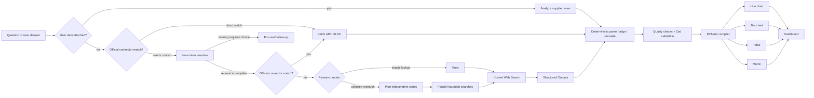

# Polaris

<p align="center">
  <strong>A live, source-backed data dashboard built from natural-language questions.</strong>
</p>

<p align="center">
  <a href="https://polaris-weifanwu.deep-robin-3429.chatgpt.site"></a>
  <a href="./LICENSE"></a>
  
  
</p>

<p align="center">
  <a href="https://polaris-weifanwu.deep-robin-3429.chatgpt.site">Live application</a>
  ·
  <a href="https://github.com/weifanwu/polaris/issues">Report an issue</a>
  ·
  <a href="#quick-start">Run locally</a>
</p>

<p align="center">
  
</p>

Polaris turns a data question—or a dataset you supply—into a reusable analytical dashboard widget. It resolves follow-up answers, routes supported requests to official structured datasets, decomposes fragmented research into independently sourced series, validates the resulting observations, and compiles them into an interactive chart, table, or metric card with an explainable analysis.

The repository is publicly available for personal, educational, research, and other noncommercial use under the [PolyForm Noncommercial License 1.0.0](./LICENSE).

## Table of contents

- [Why Polaris](#why-polaris)
- [Features](#features)
- [How it works](#how-it-works)
- [Data connectors](#data-connectors)
- [Agent observability and recovery](#agent-observability-and-recovery)
- [Cost-aware model routing](#cost-aware-model-routing)
- [Data integrity](#data-integrity)
- [Technology](#technology)
- [Quick start](#quick-start)
- [Configuration](#configuration)
- [Commands](#commands)
- [API](#api)
- [Project structure](#project-structure)
- [Security and privacy](#security-and-privacy)
- [Deployment](#deployment)
- [Contributing](#contributing)
- [License](#license)

## Why Polaris

Most AI data answers disappear into chat history. Polaris turns each successful answer into a persistent, interactive object on a personal dashboard.

Ask questions such as:

- “Compare Canada and Ontario's monthly unemployment rate over the last two years.”
- “Compare the monthly change in Toronto and Ottawa–Gatineau's New Housing Price Index over the last two years.”
- “Compare GDP in Canada, the United States, and China over the last decade.”
- “Show the Bank of Canada policy rate and CORRA over the last year.”
- “Compare monthly gold, silver, and WTI prices over the last five years.”

Polaris preserves the request, retrieved values, source links, visualization choice, and refresh state in one portable `WidgetSpec`.

## Features

### Live research agent

- Uses the OpenAI Responses API with hosted Web Search.
- Prefers official, primary, and directly attributable sources.
- Searches with canonical English names, tickers, and identifiers where useful.
- Plans fragmented comparisons before searching, researches each entity as an independent series, and aligns the results deterministically.
- Treats verified partial coverage as a useful result and preserves unavailable periods as visible chart gaps.
- Supports derived calculations such as month-over-month change when the underlying values are verifiable.
- Stops within an explicit search budget instead of retrying indefinitely.

### Analyze your own data

- Paste spreadsheet cells, CSV, TSV, JSON, or plain-text tables directly into the chat composer.
- Upload `.csv`, `.tsv`, `.json`, `.xlsx`, or `.txt` files without configuring a connector.
- Detects columns, dates, numeric measures, missing values, units, and useful comparisons before choosing a visualization.
- Performs reproducible calculations such as growth, ranking, shares, averages, and outlier detection using only supplied values.
- Keeps uploaded content in transient request state rather than browser dashboard storage; generated widgets retain the result, not the raw file.
- Labels widgets as `Your data` and disables source refresh until the dataset is supplied again.

### Deterministic data pipeline

- Routes supported requests to official APIs and downloadable workbooks before using Web Search.
- Parses source XLSX/ZIP files in the application runtime instead of asking the model to copy values from search snippets.
- Performs date alignment, missing-value handling, month-over-month calculations, and coverage checks in deterministic code.
- Checks requested dimensions before accepting a connector match; industry, occupation, geography, and frequency qualifiers cannot be silently discarded.
- Includes first-party connectors for Statistics Canada WDS, Bank of Canada Valet, World Bank Indicators and commodity data, and the U.S. BLS Public Data API.
- Automatically falls back to the bounded research agent when a connector is unsupported, unmatched, or unavailable.
- Retries transient connector timeouts, rate limits, and 5xx responses once with a bounded delay; permanent 4xx responses are never retried.
- Searches for the exact requested slice first, then honestly labelled proxy measures; it never relabels a national aggregate as an industry or occupation result.
- Allows direct connector requests to complete with zero model calls and zero Web Search calls.

### Multi-turn clarification and memory

- Asks one focused follow-up only when a missing choice materially changes the dataset.
- Remembers confirmed metrics, regions, periods, comparison groups, calculation methods, and chart preferences.
- Replaces the active context when the user starts a new, unrelated request.
- Compresses confirmed requirements into a bounded 500-character conversation state.
- Keeps up to 20 chat messages locally for presentation without resending the full transcript on every request.

### Dashboard-aware conversation

- Includes every current widget as a compact metadata index when asking Polaris a question.
- Sends titles, original requests, column identities, units, row counts, source identity, and coverage—not full raw tables—for ordinary questions.
- Expands context only when a prompt explicitly refers to the dashboard, existing widgets, or charts above; even then it adds only bounded summaries plus first/latest observations.
- Enforces a 1,400-character normal budget and a 4,200-character dashboard-reference ceiling on both client and server.
- Treats dashboard context as inert user-controlled metadata, never as model instructions or a replacement for retrieving fresh source evidence.

### Structured data and visualizations

- Supports `line_chart`, `bar_chart`, `table`, and `metric` widgets.
- Constrains model output with Structured Outputs and a fixed JSON Schema.
- Validates columns, rows, types, sources, and chart requirements with Zod.
- Supports up to six columns, 120 rows, and five clickable sources per widget.
- Renders unavailable numeric values as chart gaps rather than silently converting them to zero.
- Uses Apache ECharts for zooming, crosshair tooltips, series isolation, min/max markers, average reference lines, responsive resizing, and accessible chart descriptions.
- Shows whether a widget came from an official connector or Web Search, plus its verified coverage percentage.
- Adds an expandable analysis panel with findings, transformations, comparability warnings, and limitations.

### Flexible dashboard

- Drag widgets anywhere on the responsive grid.
- Resize from all four edges and four corners.
- Open any widget in a full-screen focus view; press `Esc` to exit.
- Refresh or remove widgets independently.
- Refresh means checking the original data identity for newer or revised observations, not regenerating the chart from scratch.
- Preserve the existing widget when source data is unchanged, older, unavailable, or incompatible.
- Require the same visualization, columns, data types, units, official connector, and—for researched widgets—at least one original publisher domain before accepting a refresh.
- Replace a widget only when its rows or column data fingerprint changes; timestamps and rewritten summaries do not count as data updates.
- Enforce a five-minute refresh cooldown to prevent accidental duplicate spend.
- Persist widgets, layouts, chat history, and compact conversation state in browser `localStorage`.

### Usage visibility

Every agent response reports:

- input tokens;
- cached input tokens;
- model calls; and
- Web Search calls.

This makes prompt growth, cache behavior, and expensive research paths visible during normal use.

Each completed response also includes an expandable **Run Trace**. It reports the operational route actually used—official connector, intent resolver, Web Search, multi-series research harness, user-data analysis, or fallback—followed by source counts, transformations, validation coverage, warnings, and tool durations when available. It does not expose private model reasoning or fabricate progress steps.

## How it works



The request lifecycle is deliberately bounded:

1. The client sends the current question and a compact conversation state.
2. Polaris first attempts a deterministic route to a supported official dataset. A complete direct request does not require a model call.
3. When conversation context is required, a lightweight intent model resolves the follow-up into one standalone query and retries connector routing.
4. Complex unmatched requests are split into independent source/entity series. Each series has its own bounded research pass, so one missing source does not invalidate the others.
5. Supplied datasets bypass Web Search and are analyzed only from the uploaded or pasted values.
6. Deterministic code parses, aligns, calculates, and validates observations; missing values remain missing.
7. The chart compiler adds interaction, analysis, and quality metadata, then the browser stores the widget locally.

The detailed design and connector contract are documented in [docs/ARCHITECTURE.md](./docs/ARCHITECTURE.md).

## Data connectors

| Connector | Coverage | Transport | Processing |
| --- | --- | --- | --- |
| Statistics Canada WDS | Canadian CPI, employment, overall and broad-industry unemployment, labour-force participation, hourly wages, monthly real GDP, quarterly population, new-housing prices, retail sales, and merchandise trade | Official JSON API with stable vectors | Province/CMA or broad-NAICS selection, monthly or quarterly alignment, unit normalization, MoM/YoY calculation |
| Bank of Canada Valet | Policy rate, Bank Rate, CORRA, prime and mortgage rates, Government of Canada bond yields, and major CAD exchange rates | Official JSON API | Date filtering, daily or monthly alignment, missing-observation checks |
| World Bank Indicators | Cross-country GDP, growth, population, inflation, unemployment, life expectancy, emissions, trade, debt, internet use, and fertility | Official JSON API | Country comparison, annual alignment, missing-observation checks, annual change calculation |
| World Bank Pink Sheet | Gold, silver, energy, metals, and major agricultural commodities | Official monthly XLSX | Sheet discovery, unit extraction, rolling period selection, MoM/YoY calculation |
| U.S. Bureau of Labor Statistics | U.S. CPI/core CPI, unemployment, participation, nonfarm payrolls, employment, and average hourly earnings | Official JSON API | Monthly alignment, seasonal-series selection, MoM/YoY calculation |

Connectors are tried in a fixed registry and must return the same validated `WidgetSpec` as the research route. This keeps rendering independent from how data was acquired and makes additional sources straightforward to add without expanding the model prompt.

The Canadian catalog uses Statistics Canada vector identifiers, which remain stable across table updates. A connector request sends only the selected vectors and requested number of periods to the publisher; full tables and long data histories are not sent through a language model. Up to five regions or countries can be aligned in one widget, and unsupported mixed-source requests fall through to bounded research instead of returning a misleading partial comparison.

Connector matching is exact with respect to requested dimensions. For example, a request for software-industry unemployment cannot fall back to Canada's overall unemployment rate. Statistics Canada publishes monthly industry unemployment only for broad NAICS groups; Polaris identifies that data gap and suggests an explicitly labelled proxy such as Professional, scientific and technical services [54], rather than generating a falsely specific chart.

## Agent observability and recovery

Polaris separates visible operational telemetry from private model reasoning:

- While a request is in flight, the interface displays only a truthful neutral state; it never claims that Web Search or validation is running until the server reports that it actually occurred.
- After completion, the Run Trace lists routing, planning, searches, cited-source collection, deterministic transformations, validation, and fallback decisions.
- API failures return a safe error code, a request ID for server-log correlation, a retryability flag, and a failed trace step. Provider secrets and raw internal exceptions are not exposed.
- The browser retains the most recent failed request in session memory. Sending `重试`, `retry`, or `try again` replays the original query, compact context, and attached transient dataset instead of treating the retry phrase as a new research question.
- Asking why the previous run failed is answered from the stored failure metadata without another model call or Web Search.
- Model-proposed rows and columns are normalized into the bounded widget contract before validation, so harmless overlong labels, extra cells, duplicate keys, or a nonnumeric chart proposal fail safely instead of becoming a generic server error.

Run traces are deliberately auditable summaries of system actions, not chain-of-thought transcripts.

## Cost-aware model routing

Polaris assigns each stage to the least expensive model tier that fits its job:

| Stage | Default model | Reasoning | Search budget |
| --- | --- | --- | --- |
| Supported official dataset | None | Deterministic code | No search |
| Clarification and context compression | `gpt-5.6-luna` | None | No search |
| Direct and short data lookups | `gpt-5.6-terra` | Low | Up to 3 calls |
| Multi-source comparisons and long series | `gpt-5.6-sol` | Low | Up to 6 calls |

Additional safeguards include:

- a stable prompt prefix and `prompt_cache_key` per route;
- no automatic full-query retry after an unsuccessful research pass;
- a 500-character conversation-state limit;
- a 1,400-character dashboard metadata budget, expanded to at most 4,200 characters only for dashboard-referential prompts;
- at most four short fallback messages during migration from older local state;
- lower Web Search context for direct lookups; and
- a refresh cooldown for recently generated widgets.
- official-connector routing before any research call; and
- parsed dataset caching for frequently refreshed official workbooks.

Model names and budgets are configurable without changing application code.

## Data integrity

Polaris follows a strict evidence contract:

- Retrieved values are never replaced with remembered, estimated, or interpolated numbers.
- Requested subgroup dimensions are never replaced with an aggregate series.
- Arithmetic may be calculated only from retrieved source values.
- A month-over-month calculation requires both adjacent verified months.
- Partial datasets are allowed by default and must disclose their actual coverage.
- Comparison charts may contain gaps when one series is unavailable for a given date.
- A widget is rejected when it has no trustworthy source or cannot be rendered honestly.
- Each generated widget records acquisition method, requested and available observations, missing observations, actual coverage, frequency, and verification time.
- A source connector is not added when its publisher's terms do not permit the intended charting or redistribution workflow.
- Proprietary MLS®/CREA feeds are not silently scraped or redistributed; Polaris uses Statistics Canada's New Housing Price Index unless a properly licensed housing feed is configured in the future.

Web Search is inherently nondeterministic, and third-party pages can change or become unavailable. Verify financial, medical, legal, and other high-stakes information against the linked original source.

## Technology

| Layer | Technology |
| --- | --- |
| Interface | React 19, TypeScript, Tailwind CSS |
| Application runtime | Vinext, Vite, React Server Components |
| AI | OpenAI Node SDK, Responses API, Web Search, Structured Outputs |
| Validation | Zod 4 |
| Charts | Apache ECharts 6 |
| Structured files | fflate XLSX/ZIP extraction |
| Dashboard layout | React Grid Layout 2 |
| Icons | Lucide React |
| Persistence | Browser `localStorage` |
| Hosting | OpenAI Sites with a Cloudflare Workers-compatible build |

## Quick start

### Requirements

- Node.js 22.13.0 or newer
- npm
- An OpenAI API key for Web Search and model-assisted requests

### Installation

```bash
git clone https://github.com/weifanwu/polaris.git
cd polaris
npm ci
cp .env.example .env.local
```

Add your API key to `.env.local`:

```dotenv
OPENAI_API_KEY=your_openai_api_key
OPENAI_MODEL=gpt-5.6-sol
OPENAI_FAST_MODEL=gpt-5.6-terra
OPENAI_INTENT_MODEL=gpt-5.6-luna
```

Start the development server:

```bash
npm run dev
```

Open [http://localhost:3000](http://localhost:3000).

Without an API key, supported official connectors and the built-in demo still work. Model-assisted clarification and Web Search require a key.

## Configuration

| Variable | Required | Default | Description |
| --- | --- | --- | --- |
| `OPENAI_API_KEY` | Yes | — | Server-side OpenAI API credential |
| `OPENAI_MODEL` | No | `gpt-5.6-sol` | Advanced model for complex, multi-source research |
| `OPENAI_FAST_MODEL` | No | `gpt-5.6-terra` | Lower-cost model for direct data lookups |
| `OPENAI_INTENT_MODEL` | No | `gpt-5.6-luna` | Lightweight model for clarification and context resolution |

Never commit `.env.local` or a real API key. The repository excludes `.env*` files except `.env.example`.

## Commands

| Command | Description |
| --- | --- |
| `npm run dev` | Start the local development server |
| `npm run build` | Create a production build |
| `npm run start` | Run the production build |
| `npm run lint` | Run ESLint |
| `npm run typecheck` | Run the TypeScript compiler without emitting files |
| `npm run test` | Run schema and agent-policy tests |
| `npm run test:schema` | Run the test file directly |
| `npm run test:connectors` | Run live integration tests against official datasets |

Before submitting a change:

```bash
npm run lint
npm run typecheck
npm run test
npm run build
```

## API

### `GET /api/health`

Reports whether the server has an API key and identifies the primary research model.

```json
{
  "status": "connected",
  "model": "gpt-5.6-sol"
}
```

### `POST /api/generate-widget`

Request:

```json
{
  "query": "Compare Canada and US CPI inflation for the last 12 complete months",
  "conversationContext": "Monthly CPI year-over-year comparison; Canada and United States; official sources; line chart",
  "history": [],
  "skipClarification": false,
  "userData": null
}
```

To analyze user-supplied data without Web Search, send a bounded dataset:

```json
{
  "query": "Compare revenue growth by region and highlight outliers",
  "userData": {
    "name": "revenue.csv",
    "format": "csv",
    "content": "month,region,revenue\n2026-01,East,125000\n2026-01,West,118000"
  }
}
```

Successful response:

```json
{
  "status": "success",
  "message": "Created a source-backed monthly CPI comparison.",
  "widget": {
    "id": "generated-uuid",
    "title": "Canada vs. United States CPI Inflation",
    "subtitle": "Latest 12 complete months · year-over-year",
    "visualization": "line_chart",
    "columns": [
      {
        "key": "month",
        "label": "Month",
        "dataType": "date",
        "unit": null
      },
      {
        "key": "canada",
        "label": "Canada",
        "dataType": "number",
        "unit": "%"
      },
      {
        "key": "united_states",
        "label": "United States",
        "dataType": "number",
        "unit": "%"
      }
    ],
    "rows": [
      {
        "cells": ["2026-06", "2.1", "2.4"]
      }
    ],
    "summary": "Official monthly CPI year-over-year rates aligned by release month.",
    "originalQuery": "Compare Canada and US CPI inflation for the last 12 complete months using official sources.",
    "sources": [
      {
        "title": "Statistics Canada",
        "url": "https://www.statcan.gc.ca/"
      },
      {
        "title": "U.S. Bureau of Labor Statistics",
        "url": "https://www.bls.gov/"
      }
    ],
    "dataQuality": {
      "method": "web_search",
      "sourceName": "Statistics Canada",
      "requestedPoints": 24,
      "availablePoints": 24,
      "missingPoints": 0,
      "coverageStart": "2025-07",
      "coverageEnd": "2026-06",
      "frequency": "monthly",
      "verifiedAt": "2026-08-07T00:00:00.000Z"
    },
    "generatedAt": "2026-08-07T00:00:00.000Z"
  },
  "conversationContext": "Monthly CPI year-over-year comparison; Canada and United States; official sources; line chart",
  "usage": {
    "inputTokens": 3240,
    "cachedInputTokens": 1100,
    "outputTokens": 420,
    "webSearchCalls": 2,
    "modelCalls": 2
  }
}
```

Clarification response:

```json
{
  "status": "needs_clarification",
  "message": "Should the comparison use month-over-month or year-over-year change?",
  "widget": null,
  "conversationContext": "Compare monthly housing prices in GTA and Ottawa"
}
```

If no exact connector matches, Web Search is mandatory. The research path checks the requested slice first and then useful, explicitly labelled proxy measures. Only when the search budget finds neither may the endpoint return `cannot_answer`; it never invents rows or silently substitutes an aggregate.

## Project structure

```text
polaris/
├── app/
│   ├── api/
│   │   ├── generate-widget/   # Intent resolution, research, and structured output
│   │   └── health/            # Runtime configuration status
│   ├── globals.css            # Global visual system and responsive layout
│   ├── layout.tsx             # Metadata and root layout
│   └── page.tsx               # Application entry point
├── components/
│   ├── widgets/               # Line, bar, table, and metric renderers
│   ├── app-shell.tsx          # Dashboard state and request orchestration
│   ├── chat-panel.tsx         # Multi-turn agent interface
│   ├── dashboard-grid.tsx     # Drag, resize, and focus interactions
│   └── widget-card.tsx        # Widget frame, sources, and actions
├── lib/
│   ├── agent-policy.ts        # Context limits and research routing policy
│   ├── data-connectors/       # Official APIs, XLSX parser, transforms, and registry
│   ├── openai.ts              # Server-side OpenAI client and model roles
│   ├── storage.ts             # Browser persistence
│   └── widget-schema.ts       # Zod schemas and API contracts
├── public/
│   └── og.png                 # Social preview image
├── scripts/
│   ├── test-schema.ts         # Schema, parser, and agent-policy tests
│   └── test-connectors.ts     # Live official-source integration tests
├── docs/
│   └── ARCHITECTURE.md        # Data-agent and connector architecture
├── types/                     # Shared frontend types
├── worker/                    # Cloudflare Worker entry point
└── .openai/hosting.json       # OpenAI Sites project configuration
```

## Security and privacy

- `OPENAI_API_KEY` is read only by the server route and is never sent to the browser.
- Widgets, layouts, chat messages, and compact conversation state remain in the current browser’s `localStorage`.
- Polaris does not maintain its own user database or server-side user profile.
- The current question and necessary compact context are sent to the OpenAI API.
- Source links can lead to third-party websites governed by their own policies.
- API keys must be rotated immediately if they are exposed in logs, screenshots, commits, or chat transcripts.

## Deployment

Polaris includes an OpenAI Sites configuration and produces a Cloudflare Workers-compatible Vinext build.

Production secrets should be configured in the hosting environment:

- `OPENAI_API_KEY`
- `OPENAI_MODEL`
- `OPENAI_FAST_MODEL`
- `OPENAI_INTENT_MODEL`

Do not place production credentials in the repository, build artifacts, Git remote URLs, or `.openai/hosting.json`.

The current production deployment is available at [polaris-weifanwu.deep-robin-3429.chatgpt.site](https://polaris-weifanwu.deep-robin-3429.chatgpt.site).

## Contributing

Bug reports, reproducible data-quality cases, documentation improvements, and focused pull requests are welcome.

1. Open an issue describing the problem or proposed change.
2. Create a branch from `main`.
3. Keep the change focused and never include credentials or local environment files.
4. Add tests for schema, routing, or data-contract changes.
5. Run the complete validation suite.
6. Submit a pull request with a concise description and verification notes.

Please use [GitHub Issues](https://github.com/weifanwu/polaris/issues) for support and feature proposals.

## License

Polaris is licensed under the [PolyForm Noncommercial License 1.0.0](./LICENSE).

You may use, study, modify, and redistribute the software for permitted noncommercial purposes. Commercial use is not permitted under this license. To discuss separate commercial licensing, open a [GitHub issue](https://github.com/weifanwu/polaris/issues).

Required Notice: Copyright 2026 Weifan Wu.
