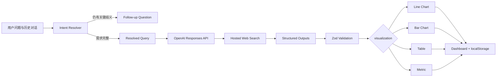

# 北极星 Polaris

<p align="center">
  <strong>把自然语言数据问题，变成可验证、可排列、可刷新的实时数据组件。</strong>
</p>

<p align="center">
  <a href="https://polaris-weifanwu.deep-robin-3429.chatgpt.site">Live Demo</a>
  ·
  <a href="https://github.com/weifanwu/polaris/issues">Report an issue</a>
</p>

<p align="center">
  
</p>

> [!NOTE]
> 当前版本是可运行、可部署的产品 POC。线上 Demo 可能要求使用 ChatGPT 登录；数据来自实时 Web Search，不应替代专业金融、法律或业务数据源。

## 目录

- [产品简介](#产品简介)
- [核心能力](#核心能力)
- [工作原理](#工作原理)
- [技术栈](#技术栈)
- [快速开始](#快速开始)
- [环境变量](#环境变量)
- [常用命令](#常用命令)
- [API](#api)
- [项目结构](#项目结构)
- [数据、安全与隐私](#数据安全与隐私)
- [部署](#部署)
- [当前边界](#当前边界)
- [路线图](#路线图)
- [贡献](#贡献)
- [许可证](#许可证)

## 产品简介

Polaris 是一个自然语言驱动的个人实时数据驾驶舱。用户可以直接描述想观察的数据，例如：

- “显示微软最近 7 个交易日的收盘价。”
- “比较多伦多和渥太华最近 24 个月的平均房价环比，使用两条不同颜色的折线。”
- “显示加拿大央行最近一年的政策利率变化。”

Polaris 会先理解需求和多轮澄清信息，再通过 OpenAI Responses API 的 Web Search 获取当前数据，生成经过校验的统一 `WidgetSpec`，最后在浏览器中渲染成折线图、柱状图、表格或指标卡。

产品目标不是让模型自由生成一段答案，而是把一次数据查询转化成一个可以继续使用的 Dashboard 组件。

## 核心能力

### 实时数据 Agent

- 使用 OpenAI Responses API 与托管 Web Search 检索公开网页。
- 支持模型主动搜索、打开数据页面并返回可点击来源。
- 搜索证据不完整时自动进行一次更深入的补充检索。
- 无法验证数据时明确拒绝生成，而不是填补或猜测缺失值。

### 多轮澄清与会话记忆

- 在搜索前独立判断需求是否已经完整。
- 自动合并最近对话中的地区、指标、周期、环比/同比和图表类型。
- 只追问仍会实质影响数据集的关键条件。
- 用户表示“其他都可以”时选择合理默认值，并在组件中说明。
- 最近 12 条消息会作为上下文发送；最近 20 条消息保存在当前浏览器。
- 成功生成后会保存一条完整、可独立重放的问题，确保 Refresh 不依赖聊天历史。

### 结构化数据与可视化

- 支持 `line_chart`、`bar_chart`、`table` 和 `metric`。
- 使用 Structured Outputs 将模型输出约束为固定 JSON Schema。
- 使用 Zod 再次校验列、行、数据类型、来源和图表要求。
- 每个真实组件最多展示 5 个可点击来源。
- 单个组件最多包含 6 列、30 行数据。

### 可组合 Dashboard

- 拖拽排列组件。
- 从四边和四角共 8 个方向调整大小。
- 全屏专注查看，支持 `Esc` 退出。
- 删除、刷新或清空 Dashboard。
- Refresh 失败时保留旧数据，不用失败响应覆盖已有结果。
- Dashboard、布局和聊天记录自动保存到 `localStorage`。

### Chat Panel

- 独立滚动并自动定位到最新消息。
- 支持多轮追问和 Widget 快速定位。
- 可单独清空对话，不影响已经创建的 Dashboard 组件。

## 工作原理



完整请求链路：

1. 浏览器向 `POST /api/generate-widget` 发送当前问题和最近对话。
2. Intent Resolver 合并多轮约束；条件不足时只返回一个澄清问题。
3. 完整需求进入 Responses API，并强制调用 `web_search`。
4. 模型按照 `WidgetSpec` Schema 返回标题、列、行、图表类型和摘要。
5. 服务端提取 Web Search 来源并执行 Zod 校验。
6. 前端根据 `visualization` 字段选择 Recharts 图表、表格或指标卡。
7. Widget 和响应式布局保存在当前浏览器。

## 技术栈

| 层级 | 技术 |
| --- | --- |
| UI | React 19、TypeScript、Tailwind CSS |
| App runtime | Vinext、Vite、React Server Components |
| AI | OpenAI Node SDK、Responses API、Web Search、Structured Outputs |
| Validation | Zod 4 |
| Charts | Recharts 3 |
| Dashboard layout | React Grid Layout 2 |
| Icons | Lucide React |
| Hosting | OpenAI Sites / Cloudflare Workers-compatible build |
| Persistence | Browser `localStorage` |

## 快速开始

### 前置要求

- Node.js `22.13.0` 或更高版本
- npm
- 一个可用的 OpenAI API Key

### 安装

```bash
git clone https://github.com/weifanwu/polaris.git
cd polaris
npm ci
cp .env.example .env.local
```

编辑 `.env.local`：

```dotenv
OPENAI_API_KEY=your_openai_api_key
OPENAI_MODEL=gpt-5.6
```

启动开发服务器：

```bash
npm run dev
```

访问 [http://localhost:3000](http://localhost:3000)。

如果没有配置 API Key，界面会显示 `Missing key`。真实搜索会被禁用，但仍可点击 `Load demo` 检查 Dashboard、图表、拖拽、缩放和全屏交互。

## 环境变量

| 变量 | 必需 | 默认值 | 说明 |
| --- | --- | --- | --- |
| `OPENAI_API_KEY` | 是 | — | 仅由服务端 API Route 读取的 OpenAI API Key |
| `OPENAI_MODEL` | 否 | `gpt-5.6` | 用于意图解析、Web Search 和 Structured Outputs 的模型 |

不要提交 `.env.local` 或任何真实密钥。仓库已经通过 `.gitignore` 排除所有 `.env*` 文件，仅保留 `.env.example`。

## 常用命令

| 命令 | 说明 |
| --- | --- |
| `npm run dev` | 启动本地开发服务器 |
| `npm run build` | 生成生产构建 |
| `npm run start` | 启动生产构建 |
| `npm run lint` | 执行 ESLint |
| `npm run typecheck` | 执行 TypeScript 类型检查 |
| `npm run test` | 运行 Schema 测试 |
| `npm run test:schema` | 直接运行 WidgetSpec Schema 测试 |

提交变更前建议运行：

```bash
npm run lint
npm run typecheck
npm run test
npm run build
```

## API

### `GET /api/health`

返回服务端是否已配置 OpenAI API Key，以及当前模型名称。

示例：

```json
{
  "status": "connected",
  "model": "gpt-5.6"
}
```

### `POST /api/generate-widget`

请求：

```json
{
  "query": "显示微软最近 7 个交易日的收盘价",
  "history": [
    {
      "role": "user",
      "content": "使用美元"
    },
    {
      "role": "assistant",
      "content": "请确认时间范围。"
    }
  ]
}
```

成功响应：

```json
{
  "status": "success",
  "message": "已生成最近 7 个交易日的收盘价。",
  "widget": {
    "id": "generated-uuid",
    "title": "微软最近 7 个交易日收盘价",
    "subtitle": "NASDAQ: MSFT · USD",
    "visualization": "line_chart",
    "columns": [
      {
        "key": "date",
        "label": "交易日",
        "dataType": "date",
        "unit": null
      },
      {
        "key": "close",
        "label": "收盘价",
        "dataType": "number",
        "unit": "USD"
      }
    ],
    "rows": [
      {
        "cells": ["2026-08-06", "499.86"]
      }
    ],
    "summary": "最近完整交易日的收盘价。",
    "originalQuery": "显示微软最近 7 个完整交易日的收盘价，单位为美元。",
    "sources": [
      {
        "title": "Nasdaq",
        "url": "https://www.nasdaq.com/market-activity/stocks/msft/historical"
      }
    ],
    "generatedAt": "2026-08-07T00:00:00.000Z"
  }
}
```

当需求仍有关键歧义时，接口返回：

```json
{
  "status": "needs_clarification",
  "message": "请选择环比还是同比。",
  "widget": null
}
```

当可靠来源不足时，接口返回 `cannot_answer`，不会创建 Widget。

## 项目结构

```text
polaris/
├── app/
│   ├── api/
│   │   ├── generate-widget/   # 意图解析、Web Search、Structured Outputs
│   │   └── health/            # API 配置状态
│   ├── globals.css            # 全局视觉与响应式布局
│   ├── layout.tsx             # Metadata 与根布局
│   └── page.tsx               # 应用入口
├── components/
│   ├── widgets/               # 折线图、柱状图、表格、指标卡
│   ├── app-shell.tsx          # Dashboard 状态与请求编排
│   ├── chat-panel.tsx         # 多轮对话界面
│   ├── dashboard-grid.tsx     # 拖拽、缩放与全屏模式
│   └── widget-card.tsx        # Widget 容器、来源与操作
├── lib/
│   ├── openai.ts              # 服务端 OpenAI Client
│   ├── storage.ts             # 浏览器持久化
│   └── widget-schema.ts       # Zod Schema 与输出契约
├── public/
│   └── og.png                 # 社交分享预览图
├── scripts/
│   └── test-schema.ts         # Schema 测试
├── types/                     # 前端共享类型
├── worker/                    # Cloudflare Worker 入口
└── .openai/hosting.json       # OpenAI Sites 项目配置
```

## 数据、安全与隐私

- `OPENAI_API_KEY` 只在服务端读取，不会发送到浏览器。
- Dashboard、布局和聊天记录存储在当前浏览器的 `localStorage`。
- 应用本身没有数据库，也不会在自己的后端建立用户档案。
- 用户问题和必要对话上下文会发送到 OpenAI API，并受对应项目的数据与保留策略约束。
- Web Search 来源来自第三方公开网站；点击来源会离开 Polaris。
- 应用会展示来源，但不保证第三方数据永久可用或没有错误。
- 对金融、医疗、法律或其他高风险数据，应回到原始来源进行确认。

## 部署

项目已包含 `.openai/hosting.json`，并使用 Vinext 生成 Cloudflare Workers-compatible 构建，可通过 OpenAI Sites 发布。

生产环境需要以托管 Secret 配置：

- `OPENAI_API_KEY`
- `OPENAI_MODEL`

不要把生产密钥写进仓库、构建产物、Git Remote URL 或 `.openai/hosting.json`。

当前部署地址：

- [https://polaris-weifanwu.deep-robin-3429.chatgpt.site](https://polaris-weifanwu.deep-robin-3429.chatgpt.site)

## 当前边界

Polaris 当前仍是 POC，以下能力尚未实现：

- 专用金融、房地产或宏观经济数据 Connector
- 服务端数据库和跨设备同步
- 用户账号与应用内权限系统
- 多 Dashboard、分享和协作
- 定时刷新、通知和后台任务
- 查询缓存、成本预算和完整可观测性
- 面向大规模数据集的分页或文件导出

此外，Web Search 具有非确定性。网页不可访问、来源缺少完整历史数据或问题跨度过大时，查询可能变慢或返回 `cannot_answer`。

## 路线图

候选方向按优先级包括：

1. 为股票、利率和房地产数据增加结构化数据 Connector。
2. 增加查询缓存、超时控制、使用量与成本监控。
3. 增加服务端 Dashboard、跨设备同步和身份认证。
4. 支持定时刷新、提醒和异常变化通知。
5. 支持多个 Dashboard、分享链接和协作权限。
6. 建立多轮澄清与数据准确性的自动化 Eval。

## 贡献

欢迎通过 [Issues](https://github.com/weifanwu/polaris/issues) 报告问题或提出功能建议。

提交 Pull Request 前：

1. 从 `main` 创建功能分支。
2. 保持变更聚焦，并避免提交任何密钥或本地环境文件。
3. 为 Schema 或数据契约变更补充测试。
4. 运行完整检查：

```bash
npm run lint
npm run typecheck
npm run test
npm run build
```

## 许可证

当前仓库尚未包含 `LICENSE` 文件，因此没有授予开源使用许可。在正式开放复用或分发前，应先选择并添加合适的许可证。
