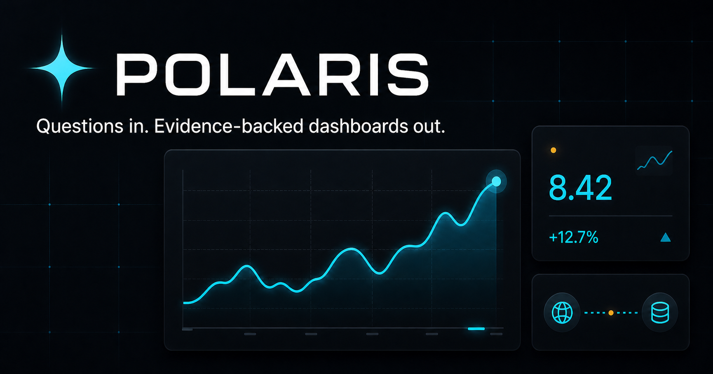
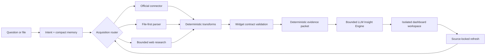

# Polaris

<p align="center">
  <strong>An open-source data analysis agent that turns questions and files into source-backed, interactive dashboards.</strong>
</p>

<p align="center">
  <a href="https://polaris-weifanwu.deep-robin-3429.chatgpt.site"></a>
  <a href="./LICENSE"></a>
  
  
</p>

<p align="center">
  <a href="https://polaris-weifanwu.deep-robin-3429.chatgpt.site">Open Polaris</a>
  ·
  <a href="https://github.com/weifanwu/polaris/issues">Report an issue</a>
  ·
  <a href="#quick-start">Run locally</a>
</p>

<p align="center">
  
</p>

Polaris is a data analysis workspace for questions that are too specific for a generic chart generator and too repetitive for a spreadsheet workflow. Ask a question in natural language, upload a CSV, XLSX, JSON, text table, or PDF, and Polaris produces a reusable widget with interactive visualization, evidence, data-quality metadata, and an analytical readout.

The system combines deterministic official-data connectors, downloadable-file parsing, bounded web research, isolated multi-dashboard memory, strict output validation, and a hybrid LLM Insight Engine grounded in reproducible statistics. The goal is not simply to draw a chart. It is to create an answer you can inspect, refresh, challenge, and continue analyzing.

> Polaris is public source code licensed for personal, educational, research, government, charitable, and other noncommercial use. Commercial use is not permitted under the included license.

## Why Polaris

Most AI data tools fail in one of two ways:

- they produce a polished chart from the wrong aggregate, incomplete dates, or undocumented assumptions; or
- they discover the right official CSV, XLSX, or PDF and stop because the search layer cannot read it.

Polaris treats data acquisition, identity resolution, transformation, analysis, and visualization as separate engineering problems. A request for an industry series cannot silently become a national total. A 20-year monthly request can return the official monthly coverage that actually exists while disclosing the uncovered period. A downloadable workbook can be parsed instead of summarized from a search snippet.

## What it can do

- Build line charts, bar charts, metric cards, and scrollable tables from natural-language questions.
- Read user-supplied CSV, TSV, JSON, XLSX, TXT, pasted tables, and PDFs.
- Follow direct links to downloadable CSV, XLS, XLSX, TSV, JSON, TXT, and PDF files.
- Route common requests directly to official structured data with no model call and no Web Search.
- Preserve follow-up decisions through compact conversation memory, including metric, geography, frequency, units, and previously selected definitions.
- Create, rename, switch, and delete focused dashboards; every dashboard owns its widgets, layout, conversation history, and agent context.
- Research fragmented comparison series independently, align dates deterministically, and preserve missing observations as gaps.
- Produce professional LLM analysis grounded in deterministic evidence: dated peaks and troughs, largest adjacent-period moves, recent momentum, cross-series spreads, hypotheses, coverage, and causal limits.
- Mark explicitly requested interpolated values as `unverified`; observed and hypothetical cells are never visually conflated.
- Drag, resize, expand, refresh, and remove dashboard widgets.
- Refresh a widget only through its original source and update it only when verified data changed.
- Show a truthful Run Trace for routing, search, file parsing, transformation, validation, and fallback decisions.

## Example questions

```text
Compare Canada and Ontario monthly unemployment rates over the last 10 years.

Show monthly permanent-resident admissions to Canada for the last 20 years.

Compare Canadian, U.S., and Chinese GDP growth over the last decade.

Analyze the attached PDF table, identify the strongest structural break, and chart it.

Use this XLSX to compare regional growth, flag outliers, and explain what could change the conclusion.
```

For the IRCC example, the current official monthly file begins in January 2015. Polaris charts every published monthly observation, reports the requested-versus-available coverage, and does not relabel older annual observations as monthly data.

## Architecture



The acquisition route is selected in this order:

1. A supplied dataset or direct file URL is analyzed as a file input.
2. An exact official connector is attempted.
3. Multi-turn intent resolution fills only materially missing choices.
4. Complex requests are decomposed into independently researchable series.
5. Bounded Web Search is used when no structured route matches.
6. A downloadable file discovered during research is passed into the file-input pipeline instead of being rejected as unreadable.
7. Rows are normalized, transformed, provenance-checked, and validated before rendering.

See [docs/ARCHITECTURE.md](./docs/ARCHITECTURE.md) for the connector contract and recovery design.

## Insight Engine

`POLARIS INSIGHTS` is produced in two explicit stages after the widget contract has passed. First, code calculates a compact evidence packet from the final rendered rows:

- latest value and full-window change;
- high and low points with dates;
- largest valid adjacent-period move;
- recent 12-month or four-quarter momentum;
- latest common-period leader, laggard, and spread for comparisons;
- missing, observed, and explicitly unverified counts; and
- a clear boundary between what the data shows and any causal explanation.

Second, `gpt-5.6-sol` receives only that evidence packet, the bounded active-dashboard metadata, compact conversation state, and up to four recent turns. A dedicated analyst prompt asks it to identify decision-relevant regime shifts, momentum, divergence, alternative explanations, tests for those hypotheses, and the evidence boundary. Numeric claims must come from the deterministic packet; professional knowledge may frame hypotheses but cannot invent events, causes, or values. If the interpretation call fails or no model key is configured, Polaris safely falls back to the reproducible statistical summary without changing the data.

This separation prevents a polished narrative from overriding the chart and avoids sending full dashboard tables back through the model.

## Multi-dashboard workspaces

A Polaris workspace can contain up to 12 named dashboards. Each dashboard persists its own:

- widget collection and responsive layout;
- compact conversation memory and recent chat history;
- metadata and statistical fingerprints sent to the agent; and
- source-locked refresh state for its widgets.

Only the active dashboard is included in an agent request. An `Economy` dashboard therefore cannot leak its charts or conversation into a `Stocks` dashboard, while the active dashboard name itself provides a small subject hint even before its first widget is created. Existing single-dashboard browser storage migrates automatically into `My Dashboard`.

## Official data connectors

| Publisher | Current coverage | Transport |
| --- | --- | --- |
| Statistics Canada | CPI, employment, overall and broad-industry unemployment, labour-force participation, wages, monthly real GDP, quarterly population, new-housing prices, retail trade, merchandise trade | Web Data Service JSON vectors |
| Immigration, Refugees and Citizenship Canada | National monthly permanent-resident admissions from the published workbook Total series | Official XLSX |
| Bank of Canada | Policy and Bank rates, CORRA, prime and mortgage rates, government bond yields, major CAD exchange rates | Valet JSON API |
| World Bank Indicators | GDP, population, inflation, unemployment, emissions, trade, debt, life expectancy, internet use, fertility | Official JSON API |
| World Bank Pink Sheet | Gold, silver, energy, metals, and agricultural commodities | Official monthly XLSX |
| U.S. Bureau of Labor Statistics | CPI, unemployment, participation, payrolls, employment, average hourly earnings | Public Data API with a structured FRED fallback and versioned emergency snapshot |

Connector matching is identity-safe. Requested industry, occupation, geography, demographic, category, frequency, and calculation qualifiers must be supported by the selected dataset. If the exact slice is unavailable, Polaris may present a clearly labelled proxy only when the user request and source make that distinction honest.

## File analysis

Polaris supports two file paths:

- **Local input:** upload or paste a dataset in the chat panel. XLSX files are converted to a bounded tabular representation in the browser; PDFs use low-detail file input by default to control tokens while retaining extracted text.
- **Remote input:** paste a direct HTTPS file URL, or let bounded research discover a direct downloadable source. Supported spreadsheet and document files are passed to the Responses API file-input pipeline.

Local text data is capped at 180,000 characters. PDF uploads are capped at 8 MB in the application, below the provider limit, to keep latency and token exposure predictable. Large corpora should use a retrieval or hosted-compute workflow instead of being placed in one request.

## Data integrity

Polaris enforces the following contract:

- Observed values, missing values, and hypotheses have distinct provenance.
- Missing numeric cells remain empty unless the user explicitly requests bounded hypothesis filling.
- Only small internal gaps with observed values on both sides may be interpolated, and every resulting cell is marked `unverified`.
- Subgroups are never silently replaced with aggregate series.
- Month-over-month and year-over-year calculations require the necessary verified source periods.
- Partial official coverage is preferred over total failure and is disclosed in the subtitle, scope, and coverage indicator.
- Search-backed widgets require cited sources.
- Model output is normalized into a strict six-column, 300-row widget contract before display.
- Refresh operations are source-locked and fingerprinted; a timestamp change alone never replaces a widget.

Important financial, legal, medical, or policy decisions should always be checked against the linked primary source.

## Agent observability

The Run Trace exposes operational events without displaying private chain-of-thought:

- route selection;
- clarification and research planning;
- actual Web Search calls;
- downloadable-file detection;
- source collection;
- deterministic alignment and calculations;
- hypothesis marking;
- schema and coverage validation; and
- safe fallback or failure boundaries.

While a request is running, the interface uses a neutral working state. It does not claim to be searching or validating until the completed trace confirms those actions.

## Cost-aware execution

| Route | Acquisition / planning | Insight pass | Search budget |
| --- | --- | --- | --- |
| Exact official connector | Deterministic code | `gpt-5.6-sol` | 0 |
| Intent and context resolution | `gpt-5.6-luna` | — | 0 |
| Direct file analysis | `gpt-5.6-sol` | `gpt-5.6-sol` | 0 |
| Direct web lookup | `gpt-5.6-terra` | `gpt-5.6-sol` | Up to 3 |
| Fragmented multi-source research | `gpt-5.6-sol` planning + `gpt-5.6-terra` series workers | `gpt-5.6-sol` | Up to 6 |

Stable prompt prefixes and cache keys improve cached-input reuse. Only the active dashboard contributes compact metadata and statistical fingerprints; full dashboard tables are never sent as ambient context. The LLM Insight Engine uses at most 18 representative rows plus deterministic statistics. Recent chat turns, conversation state, search context, file size, and model output are all bounded independently.

## Quick start

### Requirements

- Node.js 22.13 or newer
- npm
- An OpenAI API key for model-assisted analysis, file input, and Web Search

### Install

```bash
git clone https://github.com/weifanwu/polaris.git
cd polaris
npm ci
cp .env.example .env.local
```

Configure `.env.local`:

```dotenv
OPENAI_API_KEY=your_openai_api_key
OPENAI_MODEL=gpt-5.6-sol
OPENAI_FAST_MODEL=gpt-5.6-terra
OPENAI_INTENT_MODEL=gpt-5.6-luna
```

Run the application:

```bash
npm run dev
```

Open [http://localhost:3000](http://localhost:3000).

Exact official connectors can run without an API key. Clarification, user-file analysis, downloadable-file interpretation, and Web Search require one.

## Commands

| Command | Purpose |
| --- | --- |
| `npm run dev` | Start local development |
| `npm run build` | Build the production worker and client assets |
| `npm run start` | Run the production build locally |
| `npm run lint` | Run ESLint |
| `npm run typecheck` | Run TypeScript without emitting files |
| `npm run test` | Run schema, memory, parser, refresh, and Insight Engine tests |
| `npm run test:connectors` | Run live integration tests against official publishers |

Recommended pre-commit verification:

```bash
npm run lint
npm run typecheck
npm run test
npm run build
```

## Technology

| Layer | Technology |
| --- | --- |
| UI | React 19, TypeScript, responsive CSS |
| Runtime | Vinext, Vite, React Server Components, Cloudflare Workers-compatible output |
| AI | OpenAI Responses API, Structured Outputs, Web Search, file inputs |
| Validation | Zod 4 |
| Charts | Apache ECharts 6 |
| Workbooks | Deterministic XLSX/ZIP parsing with fflate |
| Layout | React Grid Layout 2 |
| Persistence | Browser `localStorage` |
| Production hosting | OpenAI Sites |

## Project structure

```text
polaris/
├── app/api/                 # Health and data-agent endpoints
├── components/              # Dashboard, chat, trace, and widget UI
├── lib/
│   ├── data-connectors/     # Official APIs, workbooks, transforms, registry
│   ├── insight-engine.ts    # Deterministic quantitative analysis
│   ├── agent-policy.ts      # Memory, ambiguity, research, and cost policy
│   ├── dashboard-context.ts # Bounded metadata and statistical fingerprints
│   ├── user-dataset.ts      # Upload and remote-file safety contract
│   └── widget-schema.ts     # Rendering and provenance schemas
├── scripts/                 # Schema and live connector tests
├── docs/ARCHITECTURE.md     # System design
├── public/og.png            # Social preview
└── worker/                  # Production worker entry point
```

## Security and privacy

- `OPENAI_API_KEY` is server-side only and is never returned to the browser.
- Do not commit `.env.local` or any real credential.
- Dashboard state and compact chat memory are stored in the current browser's `localStorage`.
- Uploaded datasets are transient request inputs and are not stored in dashboard persistence.
- Remote file URLs must use HTTPS and a supported data/document extension.
- Raw provider exceptions and secrets are replaced with bounded public error details and request IDs.

If a credential has ever been pasted into a chat, issue, screenshot, or commit, revoke it and create a new one before deployment.

## Deployment

This repository contains [`.openai/hosting.json`](./.openai/hosting.json) for the existing OpenAI Sites project. Production releases are built, committed, pushed, packaged from the exact pushed commit, saved as a version, and then deployed. Runtime secrets remain in the hosting environment and are not bundled into client assets.

Production: [polaris-weifanwu.deep-robin-3429.chatgpt.site](https://polaris-weifanwu.deep-robin-3429.chatgpt.site)

## Contributing

Issues and noncommercial contributions are welcome. A strong connector contribution should include:

- an official or clearly licensed publisher;
- deterministic matching for metric, scope, frequency, and geography;
- a documented source and transformation path;
- missing-value and revision behavior;
- quality metadata and provenance;
- schema tests and a live integration test; and
- no credential, paywall, or redistribution-policy violation.

Please open an issue before large architectural changes.

## License

Copyright 2026 Weifan Wu.

Polaris is licensed under the [PolyForm Noncommercial License 1.0.0](./LICENSE). Personal, academic, research, charitable, government, and other qualifying noncommercial use is permitted. Commercial use is not permitted. Review the license text for the complete terms.
