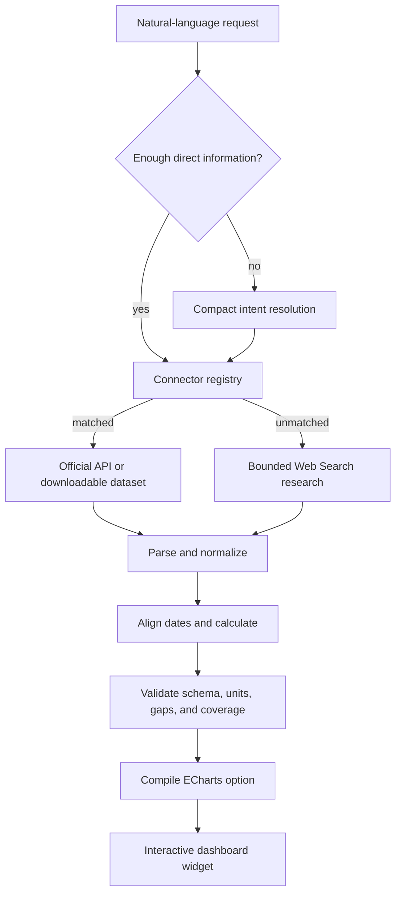

# Polaris Data Architecture

Polaris treats a chart as the final compiled view of a verified dataset. The language model is an orchestrator and fallback researcher; it is not the spreadsheet engine, calculator, or chart renderer.

## Request lifecycle



## Why this architecture

Search-result pages are useful for discovering a dataset, but they are a poor dataframe. Search snippets omit rows, reorder context, hide units, and rarely expose an uninterrupted historical series. Asking a model to reconstruct a long table from those snippets increases both input-token cost and transcription risk.

Polaris therefore prefers this order:

1. Resolve the user's metric, entities, period, frequency, calculation, and chart intent.
2. Match a deterministic connector to an official structured source.
3. Fetch the official JSON, CSV, ZIP, or XLSX payload.
4. Parse and transform it in application code.
5. Preserve unavailable observations as `null`/empty cells.
6. Validate the complete widget contract and record coverage metadata.
7. Use model-assisted Web Search only when no supported connector can answer.

This lowers cost because a direct connector request sends no dataset through a model. It improves completeness because row count is limited by the product schema rather than search-result context. It improves accuracy because formulas and date joins are testable code.

## Connector contract

Every connector implements one method:

```ts
type DataConnector = {
  id: string;
  tryResolve(query: string): Promise<DataConnectorResult | null>;
};
```

A matched connector returns a normal `WidgetSpec` payload containing columns, rows, sources, and `dataQuality`. An unmatched connector returns `null`, allowing the next connector or the research fallback to run. Connector failures are isolated and also fall through to research.

The quality envelope records:

- acquisition method (`official_connector` or `web_search`);
- source name;
- requested, available, and missing observation counts;
- actual coverage start and end;
- data frequency; and
- verification timestamp.

## Implemented sources

### Statistics Canada WDS

The connector uses Statistics Canada's stable vector identifiers and the `getDataFromVectorsAndLatestNPeriods` method. Its curated catalog covers national, provincial, territorial, and selected census-metropolitan series for CPI, labour-force conditions, average hourly wages, monthly real GDP, quarterly population, new-housing prices, retail sales, and merchandise trade. It requests only the needed vectors and periods, then aligns regions and calculates changes locally.

### World Bank Indicators

The connector uses the official Indicators API for comparable annual country data. It supports up to five countries or aggregates in one request and covers GDP, GDP growth, population, inflation, unemployment, life expectancy, carbon emissions, trade openness, government debt, internet use, and fertility. Monthly and quarterly requests are deliberately rejected because the source is annual.

### World Bank Pink Sheet

The connector discovers and downloads the current World Bank monthly commodity workbook, resolves the `Monthly Prices` worksheet through XLSX relationships, decodes shared strings and numeric cells, reads units from the workbook, and selects up to 120 current observations. Month-over-month and year-over-year changes are calculated only when both required source values exist.

The workbook is size-limited, host-validated, and cached for six hours. Gold, silver, oil, natural gas, major metals, coffee, cocoa, grains, oilseeds, cotton, and selected agricultural prices are supported.

### Bank of Canada Valet

The connector calls the official public JSON API for supported series. Daily observations can remain daily; longer histories are deterministically aligned to the last available observation in each month. It covers the policy interest rate, Bank Rate, CORRA, prime and mortgage rates, Government of Canada benchmark bond yields, and major CAD exchange-rate pairs.

### U.S. Bureau of Labor Statistics

The connector uses the BLS Public Data API for seasonally adjusted U.S. CPI, core CPI, unemployment, labour-force participation, employment, nonfarm payrolls, and average hourly earnings. Month-over-month and year-over-year changes are calculated from the retrieved index or level observations.

## Chart compiler

Both connector and research results enter the same Apache ECharts renderer. The renderer provides:

- responsive resizing inside draggable widgets;
- crosshair tooltips with units;
- multi-series legend isolation;
- min/max markers and average reference lines;
- a slider plus wheel/pinch zoom for longer series;
- explicit gaps for missing values; and
- generated accessibility descriptions and decal support.

The renderer never interpolates a missing observation and does not force the y-axis to zero for time-series data.

## Source policy

An official source is not automatically safe to integrate. Before adding a connector, verify access conditions, attribution requirements, redistribution rules, update behavior, and stable identifiers. Sources whose terms prohibit the intended display or derived charts should remain outside the connector registry until permission exists.

## Adding a connector

1. Add a bounded source module under `lib/data-connectors/`.
2. Match only requests the source can answer without semantic ambiguity.
3. Validate hostnames, response status, content type, and payload size.
4. Extract units and release metadata from the source rather than hard-coding them when possible.
5. Align dates and preserve gaps deterministically.
6. Populate `dataQuality` and source URLs.
7. Register the connector in `lib/data-connectors/index.ts`.
8. Add parser/unit tests and a live integration assertion.

Future additions should prioritize stable official APIs such as OECD, IMF, Eurostat, and licensed housing-market feeds. Each must reuse the same request and quality contracts rather than adding source-specific behavior to the chart layer.
