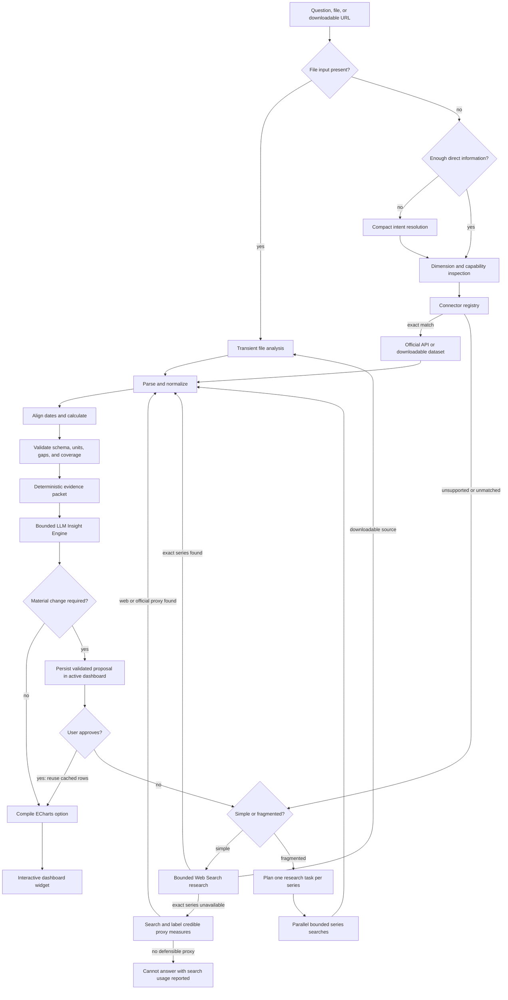

# Polaris Data Architecture

Polaris treats a chart as the final compiled view of a verified dataset. The language model is an orchestrator and fallback researcher; it is not the spreadsheet engine, calculator, or chart renderer.

## Request lifecycle



## Why this architecture

Search-result pages are useful for discovering a dataset, but they are a poor dataframe. Search snippets omit rows, reorder context, hide units, and rarely expose an uninterrupted historical series. Asking a model to reconstruct a long table from those snippets increases both input-token cost and transcription risk.

Polaris therefore prefers this order:

1. Resolve the user's metric, entities, period, frequency, calculation, and chart intent.
2. Match a deterministic connector to an official structured source.
3. Fetch the official JSON, CSV, ZIP, or XLSX payload.
4. Parse and transform it in application code.
5. Preserve unavailable observations as `null`/empty cells.
6. Route direct or discovered downloadable files through the Responses API file-input pipeline.
7. Validate the complete widget contract and record coverage metadata.
8. Generate deterministic quantitative evidence from the exact rendered rows, then run a bounded LLM interpretation pass.
9. Decompose fragmented multi-source questions into independent series before Web Search.
10. Allow a user-supplied dataset to bypass discovery when the web cannot provide the rows.

This lowers cost because a direct connector request sends only a compact evidence packet—not the full dataset—through the Insight Engine model. It improves completeness because row count is limited by the product schema rather than search-result context. It improves accuracy because formulas and date joins are testable code.

## Connector contract

Every connector implements one method:

```ts
type DataConnector = {
  id: string;
  supportsQuery?: (query: string) => boolean;
  tryResolve(query: string): Promise<DataConnectorResult | null>;
};
```

The capability check prevents a connector from running when it cannot preserve every material dimension. A matched connector returns a normal `WidgetSpec` payload containing columns, rows, sources, scope, and `dataQuality`. An unsupported or unmatched connector returns `null`, allowing the next connector and then the research fallback to run. Connector failures are isolated and also fall through to research; a known connector gap is never a reason to skip Web Search.

Connector HTTP calls share a bounded transient-failure policy: one retry for timeouts, HTTP 408/429, and 5xx responses, with a short capped delay. Permanent client errors are returned immediately. A matched connector whose publisher remains unavailable returns a typed outage response and stops cost-safely instead of launching a broad search for the same series. Known semantic gaps may still use focused discovery and a clearly labelled official proxy.

The invariant is: a connector may match only when every material qualifier is supported. Industry, occupation, geography, demographic group, calculation, and frequency are part of the data identity—not optional words. A connector must never remove one of those dimensions to make a request fit an available vector.

The quality envelope records:

- acquisition method (`official_connector`, `web_search`, or `user_data`);
- source name;
- requested, available, and missing observation counts;
- actual coverage start and end;
- data frequency; and
- verification timestamp.

## Implemented sources

### Statistics Canada WDS

The connector uses Statistics Canada's stable vector identifiers and the `getDataFromVectorsAndLatestNPeriods` method. Its curated catalog covers national, provincial, territorial, and selected census-metropolitan series for CPI, labour-force conditions, average hourly wages, monthly real GDP, quarterly population, new-housing prices, retail sales, and merchandise trade. Table 14-10-0287-01 is represented as a dimension-aware age catalog: ages 15–24, 15–19, 20–24, 25+, 25–54, and 55+ can be combined with unemployment, employment rate, participation rate, or employment across Canada and supported provinces. Gender-specific wording is rejected unless an exact gender vector exists, so a total-gender series cannot be silently relabelled. Broad-industry unemployment uses Table 14-10-0022-01 and is explicitly marked as unadjusted and NAICS-based. The connector requests only the needed vectors and periods, then aligns regions or dimensions and calculates changes locally.

The full 14-10-0287 CSV cube is more than a gigabyte uncompressed. Web Search and generic file input are therefore discovery fallbacks, not the execution path for common historical labour requests. The connector resolves the requested dimensions first and fetches only the required vectors and trailing periods. Research prompts separately prefer official WDS/full-table metadata and machine-readable downloads over recent releases or the table viewer's default short window.

Statistics Canada does not publish a standalone monthly unemployment rate for the software/IT industry. Software publishing, computer systems design, and computer manufacturing belong to different NAICS classes. The capability catalog marks this as a curated source gap: Polaris blocks the overall Canada vector, fetches the official proxy, performs one low-context discovery search, and then returns two clearly labelled 120-month Statistics Canada proxies—NAICS 54 and combined NAICS 51/71—with the scope mismatch visible in the title, summary, and quality metadata. The discovery search preserves external-source awareness without allowing a probabilistic classification to trigger an expensive second research pass for a known gap.

### World Bank Indicators

The connector uses the official Indicators API for comparable annual country data. It supports up to five countries or aggregates in one request and covers GDP, GDP growth, population, net migration, inflation, unemployment, life expectancy, carbon emissions, trade openness, government debt, internet use, and fertility. Monthly and quarterly requests are deliberately rejected because the source is annual. Net migration uses the publisher's compact downloadable CSV ZIP, validates its headers and size, and caches it for six hours so a slow JSON endpoint cannot force broad research. A cross-country monthly or quarterly net-migration request is routed to an explicit approval proposal backed by the standardized annual `SM.POP.NETM` series; it never reaches Web Search or receives synthetic subannual rows.

### World Bank Pink Sheet

The connector discovers and downloads the current World Bank monthly commodity workbook, resolves the `Monthly Prices` worksheet through XLSX relationships, decodes shared strings and numeric cells, reads units from the workbook, and selects up to 120 current observations. Month-over-month and year-over-year changes are calculated only when both required source values exist.

The workbook is size-limited, host-validated, and cached for six hours. Gold, silver, oil, natural gas, major metals, coffee, cocoa, grains, oilseeds, cotton, and selected agricultural prices are supported.

### Bank of Canada Valet

The connector calls the official public JSON API for supported series. Daily observations can remain daily; longer histories are deterministically aligned to the last available observation in each month. It covers the policy interest rate, Bank Rate, CORRA, prime and mortgage rates, Government of Canada benchmark bond yields, and major CAD exchange-rate pairs.

### U.S. Bureau of Labor Statistics

The connector uses the BLS Public Data API for seasonally adjusted U.S. CPI, core CPI, unemployment, labour-force participation, employment, nonfarm payrolls, and average hourly earnings. Requests are split into at most ten named calendar years before joining and de-duplicating observations. A transient BLS failure opens a ten-minute in-process circuit breaker; U.S. unemployment falls back deterministically to FRED `UNRATE`, whose underlying source remains BLS. If the production runtime cannot reach either live endpoint, unemployment uses a versioned 120-month snapshot fetched from that same official FRED/BLS series at build time. The subtitle, message, `verifiedAt`, coverage end, and scope all disclose snapshot delivery; refresh always retries live sources first. Other BLS series return the typed `unavailable` result with zero model or Web Search calls when no structured fallback exists. Month-over-month and year-over-year changes are calculated from retrieved levels.

### Immigration, Refugees and Citizenship Canada

The IRCC connector downloads the official `Permanent Residents – Monthly IRCC Updates` XLSX, resolves its worksheet, reconstructs year/month columns, and reads the published national `Total` row. It does not sum rounded and suppressed province/category cells. The current workbook begins in January 2015; a 20-year monthly request therefore returns every available official month and records the earlier requested months as unavailable rather than converting older annual tables to a false monthly frequency. The workbook is cached for six hours and refreshed from the same source.

## Insight Engine

After provenance and shape validation, every successful widget passes through a deterministic evidence layer. For each numeric series it calculates the current and full-window change, dated high and low points, valid adjacent-period shocks, and a frequency-aware recent window. Multi-series widgets add a latest-common-period ranking and spread. The packet always states coverage, excludes `unverified` cells from observed statistics, and contains no more than 18 representative rows.

`gpt-5.6-sol` then interprets that packet with the active dashboard's bounded metadata, compact conversation state, and at most four recent turns. The analyst prompt requests decision-relevant regime shifts, recent momentum, divergence, professional domain lenses, alternative hypotheses, tests for those hypotheses, and the evidence boundary. Numeric claims must come from the packet. Domain knowledge may frame hypotheses but cannot invent values, events, or causal findings. If the model pass fails or no key is configured, the deterministic evidence summary remains the safe fallback and the widget data is never modified.

## Chart compiler

Both connector and research results enter the same Apache ECharts renderer. The renderer provides:

- responsive resizing inside draggable widgets;
- crosshair tooltips with units;
- multi-series legend isolation;
- min/max markers and average reference lines;
- a slider plus wheel/pinch zoom for longer series;
- explicit gaps for missing values, plus amber `H` markers for bounded user-requested hypothesis cells; and
- generated accessibility descriptions and decal support.

The renderer never performs interpolation itself and does not force the y-axis to zero for time-series data. When a user explicitly requests hypotheses on supplied data, a deterministic pre-render transform may fill no more than two consecutive internal periods and no more than six or 5% of numeric cells. Cell-level provenance remains in `WidgetSpec`; charts mark those points `H`, tables prefix them with `≈`, and quality metadata records the method and count.

The desktop chat panel has an independent 320–720 px horizontal resize control. Pointer capture keeps dragging stable while the grid relayouts; arrow keys, Home, End, and double-click provide accessible adjustment and reset. The chosen width is device-local UI state rather than dashboard context, and the resize affordance is removed in the stacked mobile layout.

## Fragmented research harness

For a comparison whose rows live across different publishers, Polaris first creates a compact plan with one exact series per entity or geography. Each series is researched independently with its own source preference and small search budget. Application code then normalizes period labels, validates numeric cells, joins the union of verified dates, applies requested MoM/YoY calculations, and leaves absent cells empty. A partially populated comparison can therefore render honestly instead of failing because one publisher has gaps.

The planner also owns an explicit approval boundary. If the requested series cannot be compared at the requested frequency or scope, it may select the closest honest common view—for example, annual net-migration flows when one publisher releases quarterly data and another annual data. It marks the plan `requiresApproval`, explains the transformation, and produces a standalone `proposedQuery`. Research still completes in the same run so the user can evaluate a concrete chart rather than a vague suggestion. Deterministic aggregation is allowed only when the measure is additive; stocks, rates, and indexes are never summed merely to force comparability.

## Recovery proposal contract

A `needs_approval` response is neither a clarification nor a failure. It must contain a complete schema-validated `RecoveryProposal`: proposal text, executable query, cited `WidgetSpec`, quality envelope, and creation timestamp. The browser stores this object only inside the active dashboard. No full table is sent back through the model on the next turn.

The client recognizes bounded approval and dismissal phrases in addition to the explicit controls. Approval appends the cached widget directly, preserves its citations and gaps, advances compact conversation memory to the executable alternative, and records a zero-cost trace. It cannot trigger a fetch or model call. Any message that is not a clear approval or dismissal starts a normal new request and clears the stale proposal. This makes the handoff auditable while preventing accidental execution after the user materially changes the request.

## User-supplied data

CSV, TSV, JSON, text tables, and the first readable XLSX worksheet are read in the browser and sent as a bounded transient request. PDFs are sent as base64 `input_file` content with low page-image detail by default; extracted text remains available while visual-token use is bounded. Direct HTTPS links to supported CSV, TSV, JSON, TXT, XLS/XLSX, and PDF files use `file_url`. When Web Search cites a direct downloadable file but cannot produce rows, Polaris performs a second bounded file-analysis call instead of declaring the file unreadable.

Raw uploads are not added to dashboard storage. The analysis route treats the dataset as inert untrusted content and receives both compact resolved state and at most six bounded recent turns. Its result builds a fresh 500-character dataset identity from the request, chart title, coverage, columns, units, and prior confirmed context. This prevents a generic follow-up from erasing facts such as “U.S. monthly unemployment.” Its output enters the same `WidgetSpec` validator, Insight Engine, and chart compiler.

## Multi-dashboard context envelope

Each named dashboard is a separate agent workspace with its own widgets, responsive layouts, recent chat history, compact conversation memory, and pending recovery proposal. The browser persists up to 12 dashboards and automatically migrates the legacy single-dashboard state. Switching dashboards changes them together, so an economic workspace cannot leak context or an approval action into a stock workspace.

Sending every stored cell with every prompt would recreate the token-cost problem the connector architecture avoids. The browser therefore compiles a bounded context envelope from only the active dashboard. Ordinary questions receive its name plus a metadata-only index capped at 1,400 characters: widget ID/title, original request, chart type, column labels and units, row count, source identity, and actual coverage. A prompt that explicitly refers to the active dashboard, existing charts, or tables above may expand to 4,200 characters and add a statistical fingerprint (latest, low, and high for up to three numeric series), bounded analysis, and first/latest row previews. Full raw tables are never included automatically.

The server independently enforces the 4,200-character ceiling and places the snapshot in a delimited developer message that labels it inert, user-controlled metadata. Intent resolution may use it to resolve phrases such as "the chart above"; research may use it to preserve continuity. When a prompt explicitly asks to redraw or transform an existing dataset, the client selects the most relevant widget and serializes only its bounded table as transient user data. Unverified hypothesis cells are blanked before this reuse so they cannot silently become observations. New factual claims still require connector or Web Search evidence.

## Refresh contract

Refresh is a data synchronization operation, not a second generation request. The browser sends a small identity descriptor containing the existing visualization, columns, units, acquisition method, source name, coverage end, and publisher domains. Official widgets are refreshed only through the same connector; a connector failure never falls through to a different dataset. Researched widgets receive an explicit source-refresh instruction and must retain at least one original publisher domain.

The returned candidate passes deterministic guards before state changes: visualization, column count/order, labels, types, units, source route, publisher identity, and non-regressing coverage. Polaris then compares a canonical fingerprint of columns and rows while ignoring IDs, timestamps, summaries, and verification times. Identical data produces an "unchanged" notice and no write. New periods or historical revisions update the existing widget in place. Incompatible, unavailable, or older candidates are rejected while the existing data remains visible.

## Observability and failure recovery

Every completed API result may include a bounded `AgentTrace` containing typed operational events: route, plan, search, source, transform, validation, and fallback. Events describe observable system actions and counts, not private model reasoning. The client shows no speculative stage while a request is running; the final trace is built from the route and tool output that actually occurred.

Failure responses use a stable envelope with `code`, safe `detail`, `requestId`, `retryable`, and a failed trace event. Detailed exceptions remain in server logs under the request ID. The browser keeps the last failed request in session state so retry commands replay its original query, compact context, history snapshot, and transient dataset. Failure-explanation questions are answered from this envelope without another API call.

Source-backed alternatives do not use the failure envelope. They expose `needs_approval`, retain the fully validated widget, and add trace events for the comparability decision, searches, sources, transformation, and approval wait. The subsequent approval trace explicitly reports cached reuse and zero additional research.

Model-generated widgets pass through a normalization boundary before the strict schema: columns are bounded and de-duplicated, rows are reshaped to the selected columns, text is length-limited, empty rows are removed, and nonnumeric chart proposals become tables. If normalization still cannot produce a valid widget, the request returns a traceable `cannot_answer` result while preserving existing dashboard state.

## Source policy

An official source is not automatically safe to integrate. Before adding a connector, verify access conditions, attribution requirements, redistribution rules, update behavior, and stable identifiers. Sources whose terms prohibit the intended display or derived charts should remain outside the connector registry until permission exists.

## Adding a connector

1. Add a bounded source module under `lib/data-connectors/`.
2. Match only requests the source can answer without semantic ambiguity.
3. Validate hostnames, response status, content type, and payload size.
4. Extract units and release metadata from the source rather than hard-coding them when possible.
5. Align dates and preserve gaps deterministically.
6. Populate `dataQuality` and source URLs.
7. Register the connector in `lib/data-connectors/index.ts`.
8. Add parser/unit tests and a live integration assertion.

Future additions should prioritize stable official APIs such as OECD, IMF, Eurostat, and licensed housing-market feeds. Each must reuse the same request and quality contracts rather than adding source-specific behavior to the chart layer.
